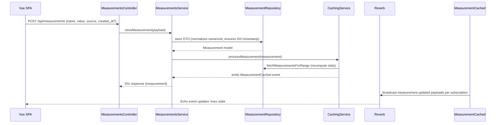
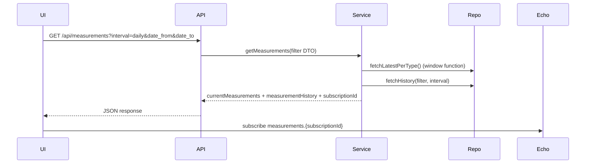

# Project Context: Autofarmer Telemetry Console
Autofarmer is a LAN-hosted monitoring and control console for a low-tech aquarium installation. It exposes a Laravel 12 (PHP 8.3) backend with a Vue 3 SPA that allows operators to record manual sensor readings, ingest automated Arduino payloads, and visualize aggregated telemetry (hourly/daily/weekly). The system is intentionally authentication-free because it runs on an isolated network. Communications happen over HTTP port 80 and a Laravel Reverb websocket server on port 6001 for realtime UI updates.

## High-Level Objectives
- Accept measurements from both automated sensors and manual operators via `/api/measurements`.
- Aggregate data for hourly/daily/weekly ranges, cache the aggregates, and push MeasurementCached events to keep clients synchronized.
- Provide a single-page dashboard that mirrors the operator’s console with: current metrics, manual entry form, historical table, chart, CSV export, and websocket updates.
- Package the entire stack in Docker (php-fpm, nginx, mysql, reverb) with a Makefile that installs deps, builds assets, runs migrations/seeders, and maintains writable storage directories.

## Architecture Overview
```
Browser SPA (Vue 3 + Vuex + Echo)
    ↕ REST + WebSocket (axios + Echo)
NGINX → PHP-FPM container (Laravel 12)
    ↕ repositories (Eloquent)
MySQL 8.4 (measurements + cache tables)
```
- **Backend**: Laravel controllers delegate to `MeasurementsService`, which coordinates DTO validation, repositories, caching, and events. Repositories encapsulate queries; services never touch Eloquent directly.
- **Events**: `MeasurementStored` triggers `CachingService` → recomputes hourly/daily/weekly caches → emits `MeasurementCached`. `BroadcastMeasurementCached` dispatches websocket payloads via Reverb to frontend subscriptions keyed by `subscriptionId`.
- **Frontend**: Vue SPA bootstrapped through Laravel Vite. Vuex store handles filters, measurement payloads, websocket registration, manual submission, and CSV export. Components (`CurrentMeasurementsPanel`, `ManualEntryForm`, `HistoryTable`, `HistoryChart`) render distinct layout regions (A/B sections matching operator requirements).
- **Realtime**: Laravel Echo (Pusher protocol) connects to local Reverb server (`ws://localhost:6001`). Client registers subscription ID received from `/api/measurements` response and listens for `.measurement.updated` events.
- **Seeding**: `php artisan measurements:seed --days=N` truncates telemetry tables, generates realistic hourly readings per measurement type, backfills cache tables without broadcasting, and reports counts.

## Data Model Summary
- `measurements`: raw samples. Columns: `name`, `unit`, `source`, `value`, `created_at`. Indexed by `(name, created_at)` and `created_at` for range scans.
- Cache tables (`hourly_caches`, `daily_caches`, `weekly_caches`): consolidated stats per measurement per range (`range_start_at`, `range_end_at`, `value_avg/min/max`, `source`, `updated_at`). Unique index on `(name, range_start_at)` plus `(range_start_at, range_end_at)` index for range filtering.
- Measurement dictionary (JSON + config) defines allowed names, display labels (including ASCII fallbacks), default units, acceptable ranges, and colors.

## Key Application Flows
### 1. Manual Entry / Sensor POST


### 2. Fetch Dashboard Data


## Deployment & Tooling Notes
- Containers: `php` (php:8.3-fpm-alpine + composer + node), `nginx` (serves `/public` via php-fpm), `mysql` (8.4 community), `reverb` (php artisan reverb:start).
- Makefile entry `ensure-storage` uses host UID/GID to chown `storage`/`bootstrap/cache` and chmod 777 so Composer/Artisan can log even after reboots.
- Environment: `.env` exposes matching `REVERB_*` and `VITE_REVERB_*` values (`host: reverb` for backend, `host: localhost` for SPA). Database credentials `autofarmer/autofarmer` with host `mysql` internally.
- Testing: `php artisan test` covers Example tests today; future tasks should add feature/unit tests per module. Vite build ensures SPA integrity.
- Permissions: `docker compose exec php ...` for Artisan/composer/npm tasks; `mysql` container for DB inspection.

## Current State Summary
- Measurement ingestion API + DTO validation implemented.
- Service/Repository/Caching/Events wired with websocket broadcasting.
- Vue SPA renders full dashboard layout, manual entry form, filters, CSV export, multi-axis chart, and table interactions. Websocket auto-refresh verified.
- Docker + Makefile orchestrate install/build/migrate/seed/up/down/logs + storage fixes.
- Indexes applied via migrations for scale readiness.

Future work can build on this by adding authentication, alerts, automation, or UI refinements, but the essential monitoring flows are complete and documented here for AI agents.
